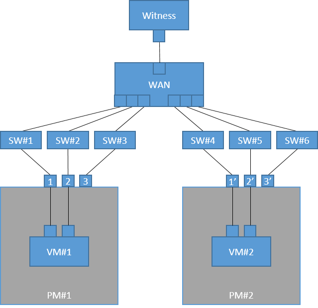
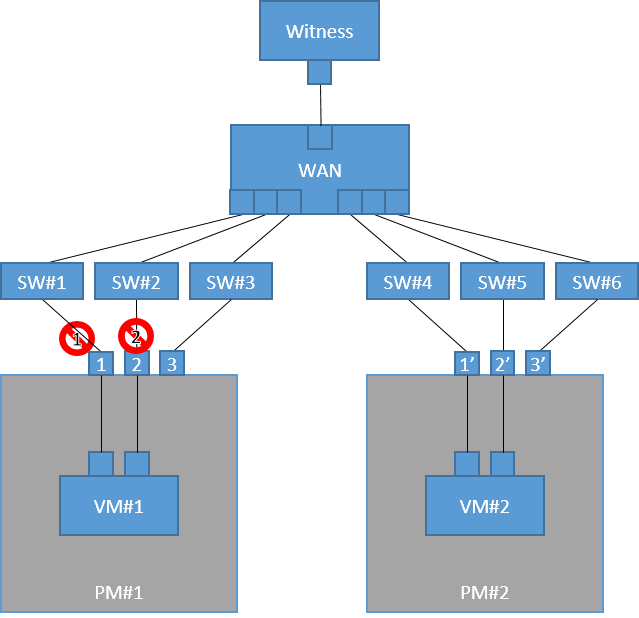
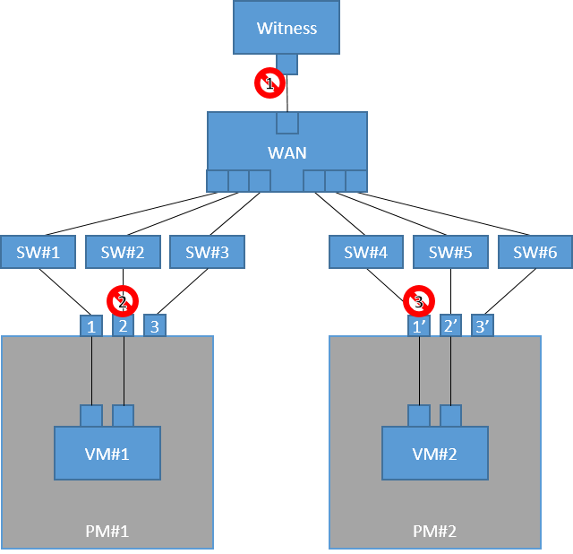

# Network Test

General HA clusters are designed to be tolerate for any single failure, so, what need to be tested is to make sure that the cluster can tolerate any single failure and can guarantee business-continuity.
This also means it cannot be tolerate multiple failures, so, it is good to know the limits by issuing multiple failures and observing business outage.
This document describes the test for network and the expected results for HA/DR cluster.

----

## Configuration

- The cluster is made of `VM#1`, `VM#2` and `Witness`. 
- NIC `1` and NIC `1'` are used for primary heartbeat network.
- NIC `2` and NIC `2'` are used for secondary heartbeat network.
- NIC `3` and NIC `3'` are used for the ECX Forced Stop function.

## Terminology

- FOG : Failover group  
- ESD : Emergency shut down
- HBTO : Heartbeat time out
- VM : Virtual Machine
- PM : Physical Machine
- SW : Network switch

## Network Partition test

Start from All Green State that FOG runs on VM#1. Disconnecting VM#1 from the cluster, then VM#1 acknowledges itself as isolated from the cluster and executes suicide (ESD) to maintain consistency of the system.

| No. | Operation | Result |
|--   |--         |--      |
| 1.  | Remove the network cable from NIC `1` and NIC `2`. | Wait for ESD of `VM#1` and for failover to `VM#2`. Make sure the business continues.
| 2.  | Connect the network cable to NIC `1` and NIC `2` then boot `VM#1`. | Wait for All Green State.
| 3.  | Remove the network cable from NIC `1'` and NIC `2'`. | Wait for ESD of `VM#2` and for failover to `VM#1`. Make sure the business continues.
| 4.  | Connect the network cable to NIC `1'` and NIC `2'` then boot `VM#2`.| Wait for All Green State.

## Forced Stop test

Start from All Green State that FOG runs on `VM#1`. Suspending `VM#1` to simulate delayed processing. `VM#2` acknowledges HBTO of `VM#1`, then processing failover. On the failover, `VM#1` is stopped (powered off) by the Forced Stop function. Confirm `VM#1` can be powered on and cannot be resumed.

| No. | Operation | Result |
|--   |--         |--      |
| 1.  | Suspend `VM#1` by the hypervisor manager. | Wait for HBTO of `VM#1` and for failover to `VM#2`. Make sure `VM#1` becomes stopped (power-off) state and the business continues.
| 2.  | Power-on `VM#1`. | Wait for All Green State.
| 3.  | Suspend `VM#2` by the hypervisor manager. | Wait for HBTO of `VM#2` and for failover to `VM#1`. Make sure `VM#2` becomes stopped (power-off) state and the business continues.
| 4.  | Power-on `VM#2`. | Wait for All Green State.

## Multiple Failures test

Even if an HA cluster is used, the system may stop on multiple failures. This test aims to have an experience for one of such cases.

**In general system operation, when an HA cluster has the first and single failure, it is expected to be repaired before the second and multiple failure.**

This also starts from All Green State that FOG runs on `VM#1`.
Disconnect the Witness, secondary heartbeat network, and primary heartbeat network.
In `VM#1` and `VM#2` view, the both consider the other to be dead. At the same time, the both can not communicate with the `Witness`. `VM#1` considers itself as isolated from the cluster and executes suicide (ESD), and `VM#2` do the same, thus the business gets outage.

| No. | Operation | Result |
|--   |--         |--      |
| 1.  | Remove the network cable from `Witness` | Wait for HBTO of `Witness` and make sure the business continues. |
| 2.  | Remove the network cable from NIC `2` of `PM#1` (for secondary HB) | Wait for HBTO for secondary HB and make sure the business continues. |
| 3.  | Remove the network cable from NIC `1'` of `PM#2` (for primary HB) | Wait for ESD of `SV#1` and `SV#2`. Confirm the stop of the business.|
